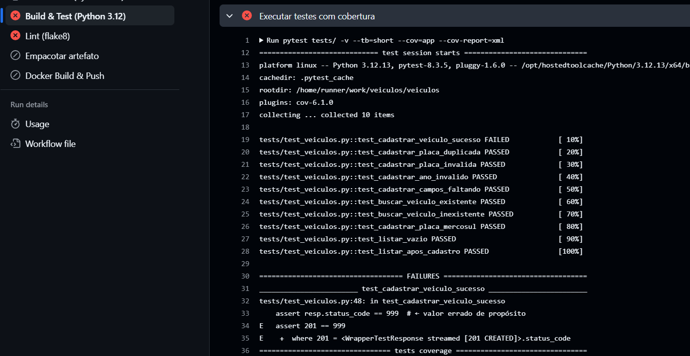
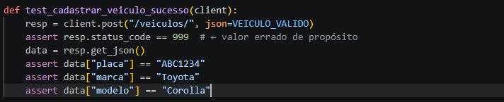
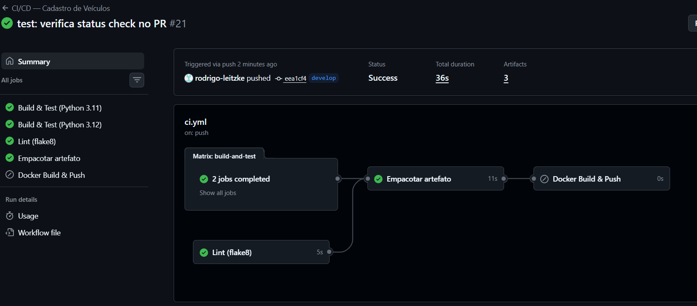

# Cadastro de Veículos API

API REST em Python/Flask para cadastro e consulta de veículos, com pipeline de CI/CD completo via GitHub Actions.

## Integrantes

- Rodrigo Leitzke
- Ericke Rafael Maas
- Leonardo Miguel Macaes
- Luiz Henrique Bassani
- Tiago Mendes Ouriques

---

## Stack

| Camada | Tecnologia |
|--------|-----------|
| Linguagem | Python 3.11 / 3.12 |
| Framework | Flask 3.1 |
| Banco de dados | SQLite |
| Testes | pytest + pytest-cov |
| Container | Docker / Docker Compose |
| CI/CD | GitHub Actions |

---

## Como executar

### Cenário 1 — Testar a imagem pronta do Docker Hub

Use este cenário para validar rapidamente se a API sobe e os endpoints funcionam, sem precisar clonar o repositório.

**1. Baixar e rodar a imagem:**

```bash
docker pull rodrigoleitzke/cadastro-veiculos:latest
docker run -p 5000:5000 rodrigoleitzke/cadastro-veiculos:latest
```

**2. Testar os endpoints (CMD do Windows):**

Cadastrar veículo:
```cmd
curl -X POST http://localhost:5000/veiculos/ ^
  -H "Content-Type: application/json" ^
  -d "{\"placa\":\"ABC1234\",\"marca\":\"Toyota\",\"modelo\":\"Corolla\",\"ano\":2022,\"cor\":\"Prata\",\"dono\":\"Joao Silva\"}"
```

Buscar veículo pela placa:
```cmd
curl http://localhost:5000/veiculos/ABC1234
```

Listar todos os veículos:
```cmd
curl http://localhost:5000/veiculos/
```

> Este cenário valida que a API sobe e os endpoints funcionam, mas não valida o código-fonte nem o build.

---

### Cenário 2 — Clonar e buildar do zero (recomendado)

Use este cenário para validar o Dockerfile, o docker-compose, o build completo e a estrutura do projeto.

**1. Clonar o repositório:**

```bash
git clone https://github.com/rodrigo-leitzke/veiculos.git
cd veiculos
```

**2. Subir a aplicação:**

```bash
docker compose up --build
```

**3. Testar os endpoints (CMD do Windows):**

Cadastrar veículo:
```cmd
curl -X POST http://localhost:5000/veiculos/ ^
  -H "Content-Type: application/json" ^
  -d "{\"placa\":\"ABC1234\",\"marca\":\"Toyota\",\"modelo\":\"Corolla\",\"ano\":2022,\"cor\":\"Prata\",\"dono\":\"Joao Silva\"}"
```

Buscar veículo pela placa:
```cmd
curl http://localhost:5000/veiculos/ABC1234
```

Listar todos os veículos:
```cmd
curl http://localhost:5000/veiculos/
```

> Este cenário valida o Dockerfile, docker-compose, build do zero, dependências e estrutura completa do projeto.

---

### Cenário 3 — Executar localmente sem Docker

```bash
pip install -r requirements.txt
python run.py
```

---

## Imagem Docker

```bash
docker pull rodrigoleitzke/cadastro-veiculos:latest
```

🔗 [Docker Hub — rodrigoleitzke/cadastro-veiculos](https://hub.docker.com/r/rodrigoleitzke/cadastro-veiculos/tags)

---

## Endpoints

| Método | Rota | Descrição |
|--------|------|-----------|
| `POST` | `/veiculos/` | Cadastrar novo veículo |
| `GET` | `/veiculos/<placa>` | Buscar veículo por placa |
| `GET` | `/veiculos/` | Listar todos os veículos |

**Body esperado no POST:**
```json
{
  "placa": "ABC1234",
  "marca": "Toyota",
  "modelo": "Corolla",
  "ano": 2022,
  "cor": "Prata",
  "dono": "Joao Silva"
}
```

Formatos de placa aceitos: padrão antigo `ABC-1234` e Mercosul `ABC1D23`.

---

## Testes

```bash
pytest tests/ -v --cov=app
```

10 testes cobrindo: cadastro válido, placa duplicada, placa inválida, ano inválido, campos ausentes, busca existente, busca inexistente, placa Mercosul, listagem vazia e listagem após cadastro.

---

## Pipeline CI/CD

```
push / PR  →  build-and-test (py3.11 + py3.12)
           →  lint / flake8 (paralelo)
                      ↓
              package — artefato zip
                      ↓
              docker push (somente main)
```

### Secrets configurados no repositório

| Secret | Descrição |
|--------|-----------|
| `API_KEY` | Chave de API fictícia |
| `DOCKERHUB_USERNAME` | Usuário Docker Hub |
| `DOCKERHUB_TOKEN` | Access Token Docker Hub |

---

## Respostas às perguntas do trabalho

### 1. O que acontece se um teste falhar? (Tarefa 3)

O step `pytest` retorna código de saída diferente de zero, o job é marcado como falho imediatamente e os jobs seguintes (`package`, `docker`) **não são executados** graças ao `needs`. O pipeline fica vermelho e o merge fica bloqueado.

Para demonstrar, alteramos o teste `test_cadastrar_veiculo_sucesso` para verificar o status code `999` (incorreto) ao invés de `201`:



Resultado no GitHub Actions — job vermelho e jobs dependentes cancelados:



---

### 2. Em que cenário real o upload de artefato é útil? (Tarefa 4)

Em deploys manuais, auditoria de versão ou quando a equipe precisa baixar o binário gerado sem precisar fazer checkout e buildar localmente. Também é útil para preservar o artefato exato que passou nos testes, garantindo rastreabilidade.

---

### 3. Por que nunca devemos commitar credenciais no código? (Tarefa 5)

Qualquer pessoa com acesso ao repositório — presente ou futuro, via histórico git — teria acesso às credenciais, mesmo que o arquivo seja deletado depois. O `git log` preserva tudo. Secrets do GitHub são armazenados de forma criptografada e nunca aparecem nos logs de execução.

---

### 4. Qual versão apresentou diferença de comportamento? (Tarefa 6)

Nenhuma diferença de comportamento entre Python 3.11 e 3.12 foi observada para este projeto. Todos os 10 testes passaram nas duas versões com o mesmo resultado. A matriz de versões serve como garantia de compatibilidade — projetos maiores podem ter dependências que se comportam diferente entre versões.

---

### 5. PR bloqueado aguardando status check (Tarefa 7)

Pipeline verde com todos os checks passando antes do merge ser liberado:



---

### 6. Por que paralelismo importa em pipelines de CI? (Tarefa 8)

Reduz o tempo total de feedback. No nosso pipeline, `build-and-test` e `lint` rodam simultaneamente — se rodassem em sequência, o tempo seria a soma dos dois. Em projetos grandes isso pode economizar vários minutos por execução, agilizando o ciclo de desenvolvimento.

---

### 7. Qual a diferença entre tag `latest` e tag por SHA? Quando usar cada uma? (Tarefa 9)

| Tag | Característica | Quando usar |
|-----|---------------|-------------|
| `latest` | Mutável — sempre aponta para a versão mais recente | Desenvolvimento, testes rápidos, ambientes não críticos |
| SHA do commit | Imutável — identifica exatamente qual commit gerou a imagem | Produção, rollback, rastreabilidade, auditorias |

Em produção sempre prefira a tag por SHA — ela garante que o mesmo código que passou nos testes é o que está rodando, sem surpresas de uma atualização involuntária do `latest`.
